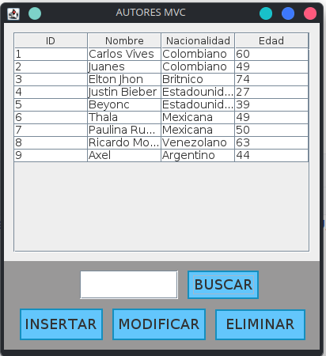

# PROYECTO JAVA MVC



Proyecto original desarrollado en 2021 para proceso de formaci�n de habilidades en programaci�n MisionTIC2022

- Usa una arquitectura de modelo, vista, controlador
- Hace conexion a base de datos a traves de jdbc
- Hace el CRUD de la tabla autores
- Usa Java Swing para la interfaz de usuario

## Iniciar Proyecto

### Requerimientos

- Docker
- IDE de java, recomendablemete IntelliJ

Ejecutar comando de docker para iniciar la base de datos mysql en el puerto 3306

```shell
docker run --name some-mysql \
  -e MYSQL_ROOT_PASSWORD=password \
  -p 3306:3306 \
  -d mysql:8.4
```

Despu�s de un tiempo de iniciado (1 min aprox) el contendor ejecutar CLI de mysql desde docker

```shell
docker exec -it some-mysql mysql --password=password
```

Copia el contenido del script [autores.sql](src/utilidades/autores.sql) ubicado en `src/utilidades/autores.sql` y pega
el contenido en la consola de mysql, esto crear� la base de datos y ingresar� algunos datos iniciales

Ejecuta el proyecto desde [RETO_5.java](src/reto_5/RETO_5.java) `src/reto_5/RETO_5`
